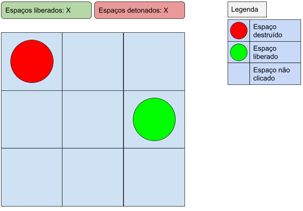

# Campo Minado

## Regras

O jogo consiste de uma **matriz 3x3** que simula um campo minado. Ao clicar em um espaço deve ser revelado se o mesmo tem ou não uma mina e atualizar o contador de espaços liberados ou de espaços detonados. Dentre os espaços devem ser distribuídas **4 minas aleatoriamente**. E ao final do jogo deve ser mostrado um alerta dizendo se o jogador venceu ou perdeu.

## Final

O jogador **ganha** quando os 5 espaços livres forem revelados e o jogador **perde** quando as 4 minas foram detonadas.

## Sugestão de modelo de UI

## O que precisa ser feito

- Implementação das features que faltam;
- Melhorias no código;
- Identificação e correção de bugs.

# Como iniciar o projeto

### `npm install`

Instala as dependências.

### `npm start`

Roda a aplicação em modo de desenvolvimento.
Abra [http://localhost:3000](http://localhost:3000) para visualizar no navegador.

